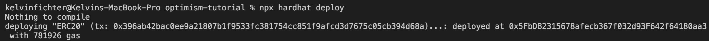
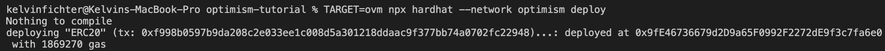

# The Official™ Optimism Tutorial

This tutorial is an introduction to the process of developing applications on Optimistic Ethereum.
We'll take you through the process of compiling, testing, and deploying a smart contract.

This tutorial aims to highlighting the similarities and differences between Ethereum and Optimistic Ethereum.
To that end, we've set the tutorial up so that you'll perform the same compile/test/deploy process on both systems at the same time.
This is *not* necessary for you to build an application on Optimistic Ethereum -- it's purely to give a side-by-side comparison.
With that said, let's dive in!

## Prerequisite Software

Please make sure you've installed the following before continuing:

- [Git](https://git-scm.com/book/en/v2/Getting-Started-Installing-Git)
- [Node.js](https://nodejs.org/en/download/)
- [Yarn](https://classic.yarnpkg.com/en/docs/install#mac-stable)
- [Docker](https://docs.docker.com/engine/install/)

## Setting Up

We've structured this tutorial as a follow-along exercise where we'll be writing code in tandem.
Please clone and enter [this repository](https://github.com/ethereum-optimism/optimism-tutorial):

```sh
git clone https://github.com/ethereum-optimism/optimism-tutorial
cd optimism-tutorial
```

We're using an Ethereum development framework called [Hardhat](https://hardhat.org) to make our lives a lot easier.
If you haven't used Hardhat before, we hope you'll be pleasantly surprised!
Hardhat is well designed and full of useful features.
Go ahead and set up Hardhat by running (along with our other dependencies):

```sh
yarn install
```

## The Task

First, we're going to be deploying an ERC20 contract (written in Solidity) to Ethereum.
After deploying to Ethereum, we'll deploy the same contract to Optimistic Ethereum.
We've already gone ahead and written that contract for you, which you should be able to locate in [`optimism-tutorial/contracts/ERC20.sol`](https://github.com/ethereum-optimism/optimism-tutorial/blob/main/contracts/ERC20.sol).
This contract is just a relatively standard (though completely unsafe) ERC20 implementation.

(**Note**: Seriously! This implementation is unsafe! Don't use it in production!)

## Step 1: Compiling your contracts

### Compiling an Ethereum contract

Just like with any other project, we'll first need to compile our Solidity into EVM bytecode.
Let's compile our ERC20 contract by running the following command:

```sh
npx hardhat compile
```

You should now see a new folder, `artifacts`, which has some JSON files in it.
If you can see this folder you're ready to move onto the next section!

### Compiling an Optimistic Ethereum contract

Compiling a contract for Optimistic Ethereum is pretty easy!
First we'll need to install the `@eth-optimism/plugins` package:

```sh
yarn add @eth-optimism/plugins
```

Next we just need to add this line to `hardhat.config.js`:

```js
// hardhat.config.js

require('@eth-optimism/plugins/hardhat/compiler')
```

We'll also have  to add `optimism` to your list of networks within `hardhat.config.ts`:

```js
// hardhat.config.js

module.exports = {
  networks: {
    hardhat: {
      accounts: {
        mnemonic: 'test test test test test test test test test test test junk'
      }
    },
    // Add this network to your config!
    optimism: {
      url: 'http://127.0.0.1:8545',
      accounts: {
        mnemonic: 'test test test test test test test test test test test junk'
      },
      ovm: true // this set the network as using the ovm and ensure contract will be compiled against that.
    }
  },
  ...
}
```

And we're ready to compile!
All you hae to do is add the `--network optimism` option to your hardhat command.

```sh
npx hardhat --network optimism compile
```

Yep, it's that easy.
You can verify that everything went well by looking for the `artifacts-ovm` and `cache-ovm` directories.
Here, `artifacts-ovm` signifies that the contracts contained in this directory have been compiled for the OVM, the **O**ptimistic **V**irtual **M**achine, as opposed to the Ethereum Virtual Machine.
Now let's move on to testing!

## Step 2: Testing your contracts

### Testing an Ethereum contract

Alright, this step is pretty straightforward.
You'll probably want to test your contracts before you deploy them (lol).
Let's see how you'd do that with Hardhat for a standard Ethereum contract.

Testing with Hardhat is easy.
We've included a simple set of ERC20 tests inside [`optimism-tutorial/test/erc20.spec.js`](https://github.com/ethereum-optimism/optimism-tutorial/blob/main/test/erc20.test.js).
Let's run these tests with hardhat:

```sh
npx hardhat test
```

If everything is going as planned, you should see a bunch of green checkmarks.

### Testing an Optimistic Ethereum contract

Woot! It's finally time to test our contract on top of Optimistic Ethereum.
But first we'll need to get a local version of Optimistic Ethereum node running...

---

Fortunately, we have a [handy dandy repository](https://github.com/ethereum-optimism/optimism-integration) that makes it easy to spin up a local Optimistic Ethereum node!

Since we're going to be using Docker, make sure that Docker is installed on your machine prior to moving on (info on how to do that [here](https://docs.docker.com/engine/install/)).

Now we just need to install our Optimistic Ethereum node by running:

```sh
git clone git@github.com:ethereum-optimism/optimism-integration.git --recurse-submodules
cd optimism-integration
./pull.sh
```

`./pull.sh` will pull the latest version of all of our docker images and make sure everything else is up to date.

Then we'll run the  `./up.sh` command to spin up our node:

```sh
./up.sh
```

Give `./up.sh` a little bit to fully start up (could be up to ~30 seconds).
We'll need to keep this terminal running for the rest of this tutorial (it's your Optimistic Ethereum node).
Go ahead and open up a second terminal so that you can run more commands while the other terminal is still running.

You now have your very own locally deployed instance of Optimistic Ethereum! 🙌

---

With your local instance of Ethereum up and running, let's go test your contracts!

```sh
npx hardhat --network optimism test
```

Again we're using the `--network optimism` option to let hardhat know that we want to use the Optimistic Ethereum solidity compiler.
This also ensure that transactions are sent to our L2 node (instead of hardhat's local L1 node).

Go ahead and run that command.
You should see another set of passing tests.
If so, congrats!
You're ready to deploy an application to Optimistic Ethereum.
It really is that easy.

## Step 3: Deploying your contracts

### Deploying an Ethereum contract

Going through this routine one more time.
Now we're going to deploy an Ethereum contract using hardhat.
We've installed and set up a tool called `hardhat-deploy` to manage this mini deployment.
You'll need to run:

```sh
npx hardhat deploy
```

This should do a deployment against a local (in-memory) Ethereum node.
Cool.
You'll see something like this in your terminal:



### Deploying an Optimistic Ethereum contract

Next we'll do the same thing on Optimistic Ethereum.
Let's go ahead and deploy this contract:

```sh
npx hardhat --network optimism deploy
```

And once again we're using the `--network optimism` option.
After a few seconds your contract should be deployed!
Now you'll see this in your terminal:



And uh... yeah.
That's pretty much it. 
Contracts deployed!
Tutorial complete.
Hopefully now you know the basics of working with Optimistic Ethereum.

The primary goal of this tutorial was to try to highlight the similarities between the process of working with Ethereum and of working with Optimistic Ethereum.
Did we do a decent job?
Could this tutorial be improved?
Please let us know by creating an issue on GitHub or by leaving a message over on [discord](https://discord.com/invite/jrnFEvq).

Want to try deploying contracts to the Optimistic Ethereum testnet next?
[Check out the full integration guide](https://community.optimism.io/docs/developers/integration.html) on the Optimism community hub.


## Until next time...


