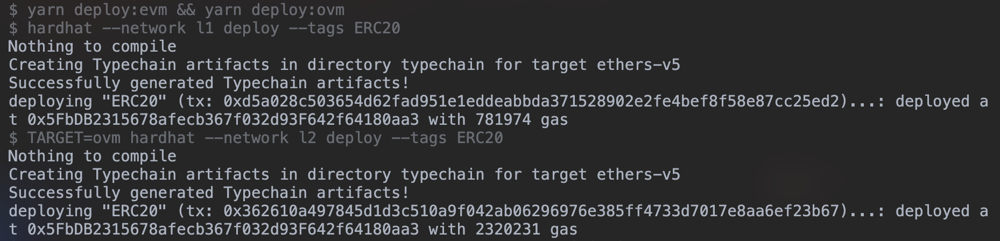

# Tutorial

Hello!
This tutorial is an introduction to the process of developing applications on Optimistic Ethereum.
Specifically, we'll take you through the process of building, testing, deploying, and interacting with a Solidity smart contract on top of the platform.

Planned future iterations of this tutorial will include:
- Communicating between Optimistic Ethereum and Ethereum.
- Using more advanced Optimism tooling.

## Prerequisite Software
We make use of some external software throughout this tutorial.
Please make sure you've installed the following before continuing:

- [Git](https://git-scm.com/book/en/v2/Getting-Started-Installing-Git)
- [Node.js](https://nodejs.org/en/download/)

## Setting Up
We've structured this tutorial as a follow-along exercise where we'll be writing code in tandem.
Please clone and enter [this repository](https://github.com/ethereum-optimism/optimism-tutorial):

```sh
git clone https://github.com/ethereum-optimism/optimism-tutorial
cd optimism-tutorial
```

We're using an Ethereum development framework called [Hardhat](https://hardhat.org) to make our lives a lot easier.
If you haven't used Hardhat before, we hope you'll be pleasantly surprised!
Hardhat is well designed and full of useful features.
Go ahead and set up Hardhat by running:

```sh
yarn
```

We'll be writing all of our smart contracts in Solidity and writing the rest of our code in TypeScript.

## The Task
We're going to be deploying an ERC20 contract (written in Solidity) to Optimistic Ethereum.
We've already gone ahead and written that contract for you, which you should be able to locate in [`optimism-tutorial/contracts/ERC20.sol`](https://github.com/ethereum-optimism/optimism-tutorial/blob/main/contracts/ERC20.sol).
This contract is just a relatively standard (though completely unsafe) ERC20 implementation.

(**Note**: Seriously! This implementation is unsafe! Don't use it in production!)

## Compiling Optimistically
Contracts deployed to Optimistic Ethereum are required to [replace certain EVM opcodes with custom behavior](https://community.optimism.io/docs/protocol/evm-comparison.html#missing-replaced-and-custom-opcodes).
Since the Solidity compiler doesn't handle this custom behavior, developers have to make sure to use the Optimism fork of the Solidity compiler instead.
We'll need to add a special plugin to hardhat that enables this custom Optimism Solidity compiler.

First, add the Optimism plugins package to your project:

```sh
yarn add @eth-optimism/plugins --dev
```

Next, add the following line to [`optimism-tutorial/hardhat.config.ts`](https://github.com/ethereum-optimism/optimism-tutorial/blob/main/hardhat.config.ts):

```ts
// hardhat.config.ts

import '@eth-optimism/plugins/hardhat/compiler'
```

Finally, compile it!

```sh
yarn compile
```

> **Side note:**  Previously, we had a plain `yarn compile` command that was used to compile your contracts. Since the recent stable release of [`@eth-optimism/plugins`](https://github.com/ethereum-optimism/plugins/releases/tag/v1.0.0-alpha.2), we made some minor changes to the workflow for compiling, deploying, and testing your contracts (all of which we will cover in this tutorial as we progress, so don't worry if it's not clear about how these pieces fit together yet). But, we think these changes profoundly improve the developer experience! So, we hope you enjoy the boost to your workflow from these changes. And as always, if you have any feedback, comments, or concerns, don't be a stranger 😊 and let us know how we can help by posting a message in our [Discord server](https://discord.gg/NypkmfSkkw)!!

Congrats, you're ready to deploy an application to Optimistic Ethereum!
It really is that easy.

You can verify that everything went well by checking the two artifact directories (`artifacts` for use on the EVM and `artifacts-ovm` for use on the OVM) and the two cache directories (`cache` and `cache-ovm`) that should be generated whenever you run `yarn compile`.

> **Side note:** Secretly, we hid the logic for this quick command within your `package.json`. There are actually _two_ compilation steps being run here, sequentially. First, `yarn compile` runs `yarn compile:evm` which obviously compiles your ERC20 contract and spits out an artifacts folder for use on the EVM. The second command being run in this step is, of course, 💃 `yarn compile:ovm` 🕺, which has a similar process, but instead uses a different naming of filepaths (which we make use of later 😉).

Here, `artifacts-ovm` signifies that the contracts contained in this directory have been compiled for the OVM, the **O**ptimistic **V**irtual **M**achine, as opposed to the Ethereum Virtual Machine.

### Running Optimistic Ethereum locally

To simulate a development environment that is as close to mainnet Optimistic Ethereum while still being local, you're we recommend replicating the layer 1 Ethereum chain and the layer 2 Optimism chain.
Fortunately, we have a handy dandy [integrations repo](https://github.com/ethereum-optimism/optimism-integration) all nicely dockerized for you to run your own local instance of Optimistic Ethereum!

Let's get our local instance setup by running these commands:

```sh
optimism-tutorial % git clone git@github.com:ethereum-optimism/optimism-integration.git --recurse-submodules
optimism-tutorial % cd optimism-integration
optimism-tutorial % ./pull.sh
```

What we're doing here first is cloning the `optimism-integration` repo, which comes with a dockerized L2 chain (OVM) and a dockerzied L1 chain (EVM).
Then, we enter the top level directory of your newly cloned (local) repo.
Next, we run the `./pull.sh` command to pull all the docker images to start your local instance.

Lastly, we'll run the `./up.sh` command to spin your docker containers up:

```sh
optimism-tutorial % ./up.sh
```

(NOTE: These last two commands are provided by shell scripts that we created for you 😊.)
The containers will take some time to fully spin up, but once they do, you should see something like this flash by in the logs at some point 
(NOTE: These logs are not important and are only shared to confirm you're running Optimistic Ethereum correctly.):


You now have your very own locally deployed instance of Optimistic Ethereum! 🙌
(NOTE: Keep these containers running! We'll be using your new local instance of Optimistic Ethereum to deploy and then test your contract.)

### Deploying to Optimistic Ethereum

<!-- 1. Intro `hardhat-deploy` -->
With your local Optimistic Ethereum network ready to go, we'll now need to deploy our ERC20 contract to the local (Optimistic) L2 chain instance.
To do that, we'll be using the helpful [`hardhat-deploy`](https://github.com/wighawag/hardhat-deploy) plugin to simplify contract deployment with deploy scripts.

Let's start by adding `hardhat-deploy` to our list of `devDependencies` with the following command:
```sh
optimism-tutorial % yarn add hardhat-deploy --dev
```

Now, we're able to start writing our deploy script.
First, we'll want to create a directory called `deploy` and our deploy script within that directory.
You can do this with the following command:
```sh
optimism-tutorial % mkdir deploy && cd deploy && touch deployERC20.ts
```

Since we're using TypeScript, we'll start editing our new deploy script by adding types for [`hardhat-deploy`](https://github.com/wighawag/hardhat-deploy) and `hardhat` for static type checking of this file.
So, let's add the following imports to your `deployERC20.ts` like so:
```typescript
import {HardhatRuntimeEnvironment} from 'hardhat/types'
import {DeployFunction} from 'hardhat-deploy/types'
```

Next, we'll add your deploy function for your ERC20 contract.
Note that this deploy script (along with a few magic tricks that we'll explain later 🧙‍♂️) will be used to handle contract deployment to both layer 1 Ethereum and layer 2 Optimistic Ethereum.
Ain't that neat!

First, we'll show you the deploy function and then explain how it works.
Let's now add this function below our imports that added in the last step:
```typescript
const func: DeployFunction = async (hre: HardhatRuntimeEnvironment) => {
  const { deployments, getNamedAccounts } = hre
  const { deploy } = deployments

  const { deployer } = await getNamedAccounts()

  const _initialSupply = hre.ethers.utils.parseEther('1000000000')
  const _name = 'My ERC20 Token'

  await deploy('ERC20', {
    from: deployer,
    args: [_initialSupply, _name],
    gasPrice: hre.ethers.BigNumber.from('0'),
    log: true
  })
}

export default func
func.tags = ['ERC20']
```

If you have used `hardhat-deploy` before, this function will look quite familiar.
That's because this function is actually from one of `hardhat-deploy`'s [examples for a simple ERC20](https://github.com/wighawag/template-ethereum-contracts/blob/main/deploy/001_deploy_simple_erc20.ts#L5-L18).
To make this tutorial easy, we decided to add a few things so that using this example script was seamless.

What we do first is extract from `deployments` extension and `getNamedAccounts` method from the `hre`.
Then, we extract our beloved `deploy` method from the `deployments` extension  and extract the `deployer` account, a named account that is prespecified in your `hardhat.config.ts` as the first address, from the `getNamedAccounts` method.
Next, we add the name of your contract, in this case it's `ERC20`, as the first argument to the deploy method.
And here is the exciting part: in the deployment options (the second argument denoting by the `{}`), we specify:

1. Which address we want to deploy your ERC20 contract from,
2. The arguments your contract requires in it's constructor or initializer,
3. The gas price to deploy your contract (we of course want it to be 0!), and lastly,
4. Whether we want to display logs when running our deploy script.

Easy enough right?

> If you're still confused by these deploy options, we recommend reviewing the [Configuration](https://github.com/wighawag/hardhat-deploy#configuration) and [How to Deploy Contracts](https://github.com/wighawag/hardhat-deploy#how-to-deploy-contracts) sections from `hardhat-deploy`'s documentation.

To complete our deploy script, we export our function, `func`, and give it a function tag called `ERC20`.
This function tag helps us specify which deploy script we want to run when using `hardhat-deploy` in the CLI.

Although we have only one deploy script for now, this simplifies our `yarn` commands.
So, to deploy your ERC20 contract to your local layer 1 Ethereum _and_ layer 2 Optimistic Ethereum networks, just run `yarn deploy`!

You'll see something like the following in your console or terminal if this running the command was successful:



#### A explainer for beginners

Similar to when we ran `yarn compile`, there's some Node.js script magic going on here, but it's quite simple.

First, `yarn deploy` starts the chain of commands by running `yarn deploy:evm`, which deploys your ERC20 contract with the following command:

```shell
hardhat --network l1 deploy --tags ERC20
```

What this command does is specify the deployment network `l1` (which is prespecified for you in your `hardhat.config.ts` 😎), then it uses `deploy` ([the `deploy` task from `hardhat-deploy`](https://github.com/wighawag/hardhat-deploy#the-deploy-task)) to run our deploy function by the function tag we used to specify it (i.e. `ERC20`).

Second in the chain of commands is `yarn compile:ovm` which similarly deploys your ERC20 contract, but instead of deploying to layer 1 Ethereum, it deploys to layer 2 Optimistic Ethereum 🪄 ✨.
This black magic process comes from `@eth-optimism/plugins` which lets you specify when you are deploying your contracts with `hardhat-deploy`, whether you are deploying to the OVM or to the EVM with this additional flag in the CLI, `TARGET=ovm`.

The full command:
```shell
TARGET=ovm hardhat --network l1 deploy --tags ERC20
```

WAIT, how the heck are my contract ABIs and bytecode being accounted for when deploying to the `l1` or `l2` networks?
Great question!
This is more black magic from `hardhat-deploy`'s synergy with `@eth-optimism/plugins`, which tells `hardhat-deploy` if it sees the `TARGET=ovm` flag, "Yo `hardhat-deploy`! We're deploying for the OVM!! Here's the contract deployment info you need to deploy this contract 😎".
Then, `hardhat-deploy`, having everything it needs to initiate a contract deployment to the OVM, runs the deploy script to deploy the specified contract to the OVM!
And if `@eth-optimism/plugins` doesn't see the flag, then `hardhat-deploy` carries on its usual path of deploying to the EVM.

------------------------

<!-- 5. Fun closing! (and transition to testing) -->
💥 BOOM 💥.
We've now deployed your ERC20 contract to your local layer 1 Ethereum and layer 2 Optimistic Ethereum networks!

Now onto the smoothest side of this tutorial.

### Test Prep
No, this kind of preparation is not anything even remotely similar to exam preparation.
What we're doing next is preparing the seamless experience of running our contracts tests for both the EVM and OVM.

And this will only take us a max of 3 steps:

1. Duplicate our `erc20.spec.ts` test file and name it `optimistic-erc20.spec.ts`.
2. Make the necessary changes in `optimistic-erc20.spec.ts`.
3. Run `yarn test`


### 

<!-- 1. Explain integration vs. unit testing -->
Integration

<!-- 2. Why we're doing integration testing and not unit testing -->


### "Started from the bottom now where here"
