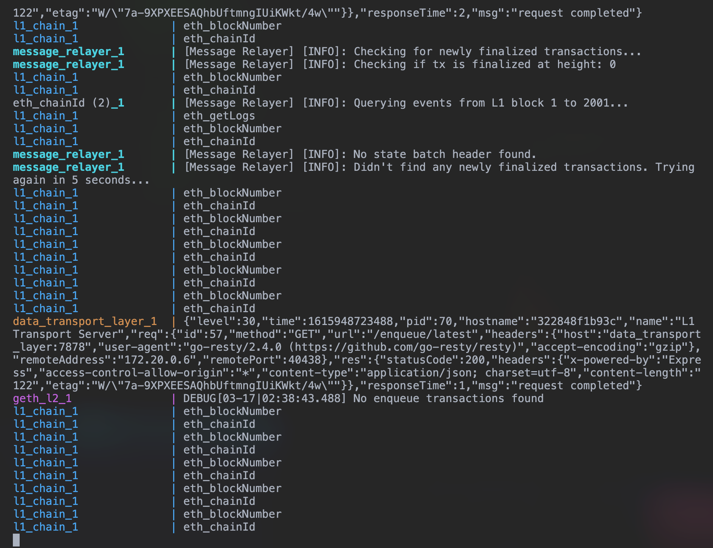
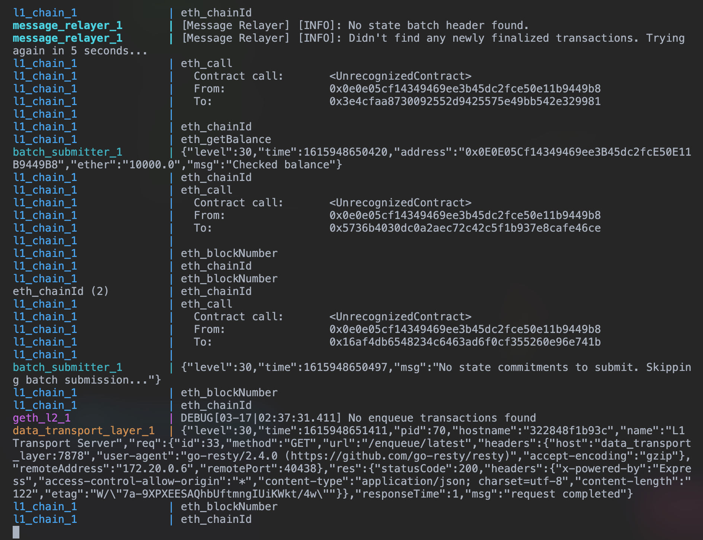
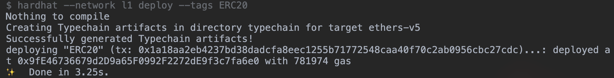
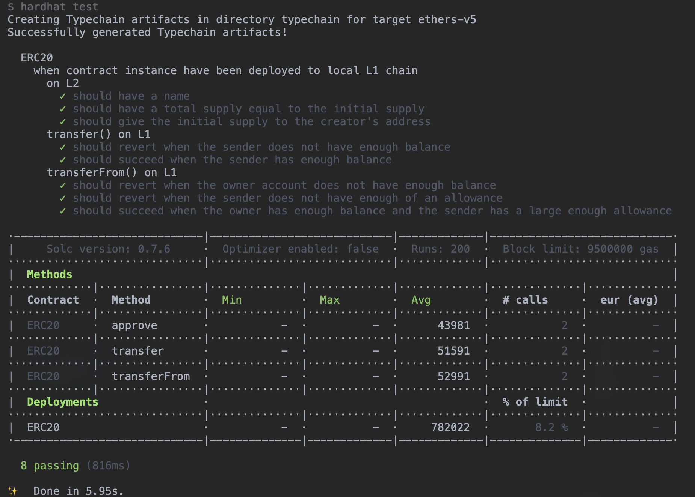
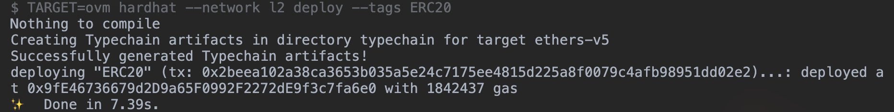
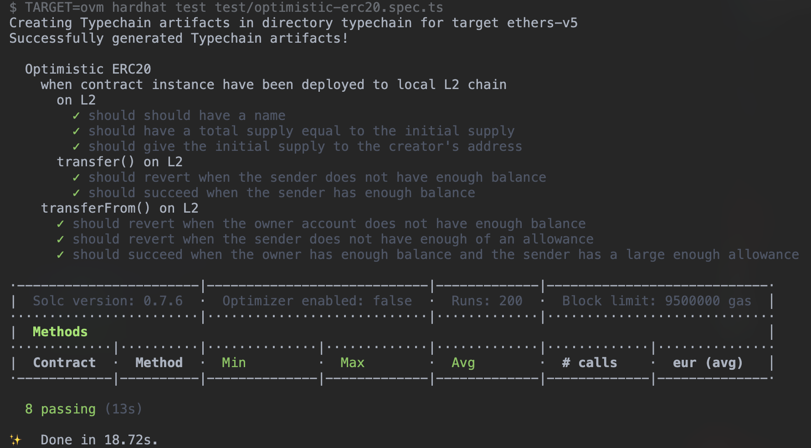

# Tutorial

Hello!
This tutorial is an introduction to the process of developing applications on Optimistic Ethereum.
Specifically, we'll take you through the process of building, testing, deploying, and interacting with a Solidity smart contract on top of the platform.

Planned future iterations of this tutorial will include:

- Communicating between Optimistic Ethereum and Ethereum.
- Using more advanced Optimism tooling.

## Prerequisite Software

We make use of some external software throughout this tutorial.
Please make sure you've installed the following before continuing:

- [Git](https://git-scm.com/book/en/v2/Getting-Started-Installing-Git)
- [Node.js](https://nodejs.org/en/download/)

## Setting Up

We've structured this tutorial as a follow-along exercise where we'll be writing code in tandem.
Please clone and enter [this repository](https://github.com/ethereum-optimism/optimism-tutorial):

```sh
git clone https://github.com/ethereum-optimism/optimism-tutorial
cd optimism-tutorial
```

Still within that directory, copy `.env-example` and rename it to `.env`, like so:

```sh
cp .env-example .env
```

We're using an Ethereum development framework called [Hardhat](https://hardhat.org) to make our lives a lot easier.
If you haven't used Hardhat before, we hope you'll be pleasantly surprised!
Hardhat is well designed and full of useful features.
Go ahead and set up Hardhat by running:

```sh
yarn
```

We'll be writing all of our smart contracts in Solidity and writing the rest of our code in TypeScript.

## The Task

First, we're going to be deploying an ERC20 contract (written in Solidity) to Ethereum.
After deploying to Ethereum, we'll  deploy the same contract to Optimistic Ethereum.
We've already gone ahead and written that contract for you, which you should be able to locate in [`optimism-tutorial/contracts/ERC20.sol`](https://github.com/ethereum-optimism/optimism-tutorial/blob/main/contracts/ERC20.sol).
This contract is just a relatively standard (though completely unsafe) ERC20 implementation.

(**Note**: Seriously! This implementation is unsafe! Don't use it in production!)

## Compiling, Deploying, and Testing Contracts for Ethereum

### Compiling a contract for the EVM

Let's compile your ERC20 contract by running the following command:

```sh
yarn compile
```

This will output the `artifacts` (including our contract's JSON object which contains the contract ABI and bytecode that we'll use later in our tests) that we'll use to deploy your contract to the EVM.

### Deploying a contract to the EVM

To deploy your ERC20 contract to Ethereum, we have included a deploy script that uses [`hardhat-deploy`](https://github.com/wighawag/hardhat-deploy) to handle contract deployments to networks that we specify.

But first, we'll need to setup a local Ethereum chain.

-------

### Running Ethereum and Optimistic Ethereum locally

To simulate a local development environment that is as close to mainnet Optimistic Ethereum as possible, we recommend replicating the layer 1 Ethereum chain and the layer 2 Optimistic Ethereum chain.
Fortunately, we have a handy dandy [integrations repo](https://github.com/ethereum-optimism/optimism-integration) all nicely dockerized for you to run your own local instances of Ethereum and Optimistic Ethereum!

Since we're using Docker, make sure that Docker is installed on your machine prior to spinning up the integrations repo (info on how to do that is [here](https://docs.docker.com/engine/install/)!).

Now, let's get our local instances of Ethereum and Optimistic Ethereum setup by running these commands in your terminal:

```sh
git clone git@github.com:ethereum-optimism/optimism-integration.git --recurse-submodules
cd optimism-integration
./pull.sh
```

What we're doing here first is cloning the `optimism-integration` repo, which comes with a dockerized dockerzied L1 chain (EVM) and L2 chain (OVM), and enter into its directory.
Next, we run the `./pull.sh` command to pull all the docker images to start your local instance.

Lastly, we'll run the `./up.sh` command to spin up both chains:

```sh
./up.sh
```

Once the containers have fully spinned up, you should see something like this flash by in the logs (the logs themselves are unimportant for us, so we can ignore them):




(Make sure to keep these containers running!)

You now have your very own locally deployed instances of Ethereum and Optimistic Ethereum! 🙌

-------

With your local instance of Ethereum up and running, let's deploy our contract to the EVM by running the following command:

```sh
yarn deploy
```

You should see something like the following in your console logs if this process was successful:



### Testing a contract in the EVM

Later, we'll deploy and test your contract to and against your new local instance of Optimistic Ethereum. But, for now, let's use your new local instance of Ethereum to run your EVM-integration tests by running this command in your terminal:

```sh
yarn test
```

You should see these tests passing in your console logs similar to the image below:



## Compiling, Deploying, and Testing Contracts for Optimistic Ethereum

### Updating our `package.json` scripts

Up to now, the workflow we've followed has only been for Ethereum and not for Optimistic Ethereum.

Even, in your `package.json` you'll notice that in your Node deploy script, we deploy your contract to your local `l1` chain (prespecified in your `hardhat.config.ts` under `networks: {`).
Thus, to get your project ready with similarly simple Node commands, we're going to make some changes to your `package.json` scripts so that the workflow for compiling, deploying, and testing your ERC20 contract for Ethereum is as quick as the workflow for Optimistic Ethereum.

Let's duplicate the `compile`, `deploy`, and `test` scripts in your `package.json` and update each script to ensure that each is only compatible for either Ethereum or Optimistic Ethereum, like so:

```json
{
  "scripts": {
    "clean": "rimraf ./cache-ovm && rimraf ./cache-ovm && rimraf ./artifacts && rimraf ./artifacts-ovm && rimraf ./deployments",
    "compile:evm": "hardhat compile",
    "compile:ovm": "TARGET=ovm hardhat compile",
    "deploy:evm": "hardhat --network l1 deploy --tags ERC20",
    "deploy:ovm": "TARGET=ovm hardhat --network l2 deploy --tags ERC20",
    "test:evm": "hardhat test test/erc20.spec.ts",
    "test:ovm": "TARGET=ovm hardhat test test/optimistic-erc20.spec.ts"
  }
}
```

Now with your new scripts added to your `package.json`, you can run through a similar workflow to compile, deploy, and test your ERC20 contract to and in Optimistic Ethereum! 🎉

### Compiling a contract for the OVM

Contracts deployed to Optimistic Ethereum are required to [replace certain EVM opcodes with custom behavior](https://community.optimism.io/docs/protocol/evm-comparison.html#missing-replaced-and-custom-opcodes).
Since the Solidity compiler doesn't handle this custom behavior, developers have to make sure to use the Optimism fork of the Solidity compiler instead.
We'll need to add a special plugin to hardhat that enables this custom Optimism Solidity compiler.

First, add the Optimism plugins package to your project:

```sh
yarn add @eth-optimism/plugins --dev
```

Next, add the following line to your `hardhat.config.ts`:

```ts
// hardhat.config.ts
import '@eth-optimism/plugins/hardhat/compiler'
```

Finally, compile it!

```sh
yarn compile:ovm
```

You can verify that everything went well by checking the `artifacts-ovm` and `cache-ovm` directories that should be generated whenever you run `yarn compile:ovm`.

Here, `artifacts-ovm` signifies that the contracts contained in this directory have been compiled for the OVM, the **O**ptimistic **V**irtual **M**achine, as opposed to the Ethereum Virtual Machine.

Congrats, you're ready to deploy an application to Optimistic Ethereum!

It really is that easy.

### Deploying a contract to Optimistic Ethereum

With your local instance of Optimistic Ethereum (your local L2 chain) ready to go, all you need to do to deploy your ERC20 contract to the OVM is run the following command in your terminal:

```sh
yarn deploy:ovm
```

If the deployment was successful, you will see similar helpful logs as we saw when deploying to Ethereum:



Easy enough right?  

We've now deployed your ERC20 contract to your local layer 1 Ethereum and layer 2 Optimistic Ethereum networks!

Now onto the smoothest side of this tutorial.

### Test Prep

What we're going to do next is prepare the seamless experience of running your contract tests for the OVM.

This will be done in three steps:

1. Duplicate our `erc20.spec.ts` and rename it `optimistic-erc20.spec.ts`.
2. Make the necessary changes in `optimistic-erc20.spec.ts` and friends.
3. Run `yarn test`

Since the first step is quite straightforward, we'll assume you can do that step without guidance and move on to step 2 ➡️.

#### 2. Make the necessary changes in `optimistic-erc20.spec.ts` and friends

In your newly named `optimistic-erc20.spec.ts` file, we're first going to update the path for `deploymentsInfo` so that we're retrieving your contract artifact for layer 2 Optimistic Ethereum and _not_ layer 1 Ethereum.

Go ahead and update line 8 in `optimistic-erc20.spec.ts` to:

```typescript
import deploymentsInfo from '../deployments/l2/ERC20.json'
```

Next, we'll quickly borrow a set of [utility functions from our friends at Synthetix](https://github.com/Synthetixio/synthetix/blob/develop/test/optimism/utils/revertOptimism.js) that will help us retrieve transaction revert reasons for transactions of contracts that have been deployed to the OVM.

Let's start by importing the utility function `assertRevertOptimism` on the line right after `deploymentsInfo`:

```ts
import { assertRevertOptimism } from './utils'
```

Then, we'll create `utils.ts`, and under the `test` directory, add the following code to it!:
```ts
import { ethers } from 'hardhat'

function _hexToString(hex: string) {
  let str = ''

  const terminator = '**zÛ'

  for (var i = 0; i < hex.length; i += 2) {
    str += String.fromCharCode(parseInt(hex.substr(i, 2), 16))

    if (str.includes(terminator)) {
      break
    }
  }

  return str.substring(0, str.length - 4)
}

async function getOptimismRevertReason({ tx, provider }) {
  try {
    let code: any = await provider.call(tx)
    code = code.substr(138)

    // Try to parse the revert reason bytes.
    let reason: string

    if (code.length === 64) {
      reason = ethers.utils.parseBytes32String(`0x${ code }`)
    } else {
      reason = _hexToString(`0x${ code }`)
    }

    return reason
  } catch (suberror) {
    throw new Error(`Unable to parse revert reason: ${ suberror }`)
  }
}

async function assertRevertOptimism({ tx, reason, provider }) {
  let receipt: any,
    revertReason: string | any[]

  try {
    receipt = await tx.wait()
  } catch (error) {
    revertReason = await getOptimismRevertReason({ tx, provider })
  }

  if (receipt) {
    throw new Error(`Transaction was expected to revert with "${ reason }", but it did not revert.`)
  } else {
    if (!revertReason.includes(reason)) {
      throw new Error(
        `Transaction was expected to revert with "${ reason }", but it reverted with "${ revertReason }" instead.`
      )
    }
  }
}

export { assertRevertOptimism }
```

This code might look a bit overwhelming, but trust us, it isn't!
Simply, [what Synthetix has done here](https://github.com/Synthetixio/synthetix/blob/develop/test/optimism/withdrawals.test.js#L131-L140) is create a function called `assertRevertOptimism` that will show us revert reasons when we run our integration tests against the OVM that require to return a revert reason.

Now with that out of the way, let's get back to finishing our changes to `optimistic-erc20.spec.ts`.

At the top, you'll want to add this code block of `privateKey` variables.
We will use these private keys for creating our accounts for the specified provider:

```typescript
const privateKey1: string = ethers.Wallet.createRandom().privateKey
const privateKey2: string = ethers.Wallet.createRandom().privateKey
const privateKey3: string = ethers.Wallet.createRandom().privateKey
```

Next, right above the before-statement called `'connect to contracts'`, we'll set 3 accounts, using the provider and private keys we just created in the previous step, and remove the accounts created using `;[account1, account2, account3] = await ethers.getSigners()`, like so:

```ts
account1 = new ethers.Wallet(privateKey1, provider)
account2 = new ethers.Wallet(privateKey2, provider)
account3 = new ethers.Wallet(privateKey3, provider)

before('connect to contracts', async () => {
  // -------- DELETE THE LINE BELOW! --------
  // ;[account1, account2, account3] = await ethers.getSigners()
```

On to the tests!

Let's move on to using that `assertRevertOptimism` function we borrowed from Synthetix.

In your test file there are three different it-statements that have revert checks that need to be updated to run properly (so our tests pass!).
What we'll do first here is add an `await` to the very front of each of these contract calls.

These three it-statements are called:

1. `'should revert the sender does not have enough balance'`
(line 88 in `erc20.spec.ts`)
2. `'should revert when the owner account does not have enough balance'`
(line 138 in `erc20.spec.ts`)
3. `'should revert when the sender does not have enough of an allowance'`
(line 155 in `erc20.spec.ts`)

These additions of `await` will ensure that the contract calls complete before running our assertion checks with `assertRevertOptimism`.

Now, let's add our assertion checks!

Going through the same list of three it-statements, we'll change the `await expect(tx).to.be.revertedWith()` lines to:
```ts
// Test whether the call on Optimism reverts with the following reason.
await assertRevertOptimism({
  tx,
  reason: "<REVERT_REASON",
  provider: provider
})
```

where the revert `reason` is equal to:

1. `"You don't have enough balance to make this transfer!"`
2. `"Can't transfer from the desired account because you don't have enough of an allowance."`
3. `"Can't transfer from the desired account because you don't have enough of an allowance."`

respectively, for each it-statement's assertion.

Way to go!
You're now set to run your integration tests for the OVM! 🙌

#### 3. Run `yarn test`
> "Started from the bottom now we're here." - Drake

And now...for the moment you've all been waiting for...

Please, put your fingers together for...
```sh
yarn test:ovm
```

(and don't forget to enter the above command in your terminal!)

If you've been following this tutorial closely, and have made no errors along the way, you'll see console logs like this:



And there you have it!

If that didn't take your breath away, I'd suggest adding this Node script to your `package.json`:
```json
{
  "all": "yarn clean && yarn compile:evm && yarn compile:ovm && yarn deploy:evm && yarn deploy:ovm && yarn test:evm && yarn test:ovm"
}
```

and running it while listening to some suitable music (play the video after running the command):

```sh
yarn all
```

<figure class='video_container'>
  <iframe
    width='100%'
    allowfullscreen
    frameborder='0'
    src="./assets/videos/optimism-tutorial-completion.mp4"
    type="video/mp4"
  >
  </iframe>
</figure>

## Until next time...
