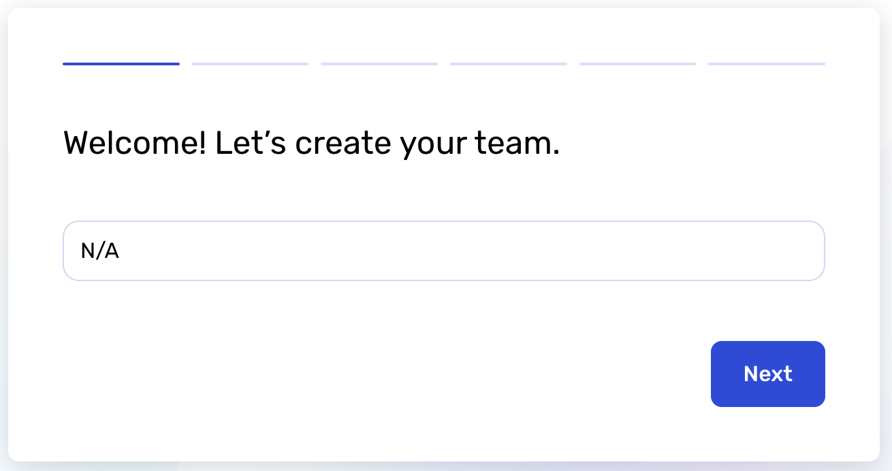
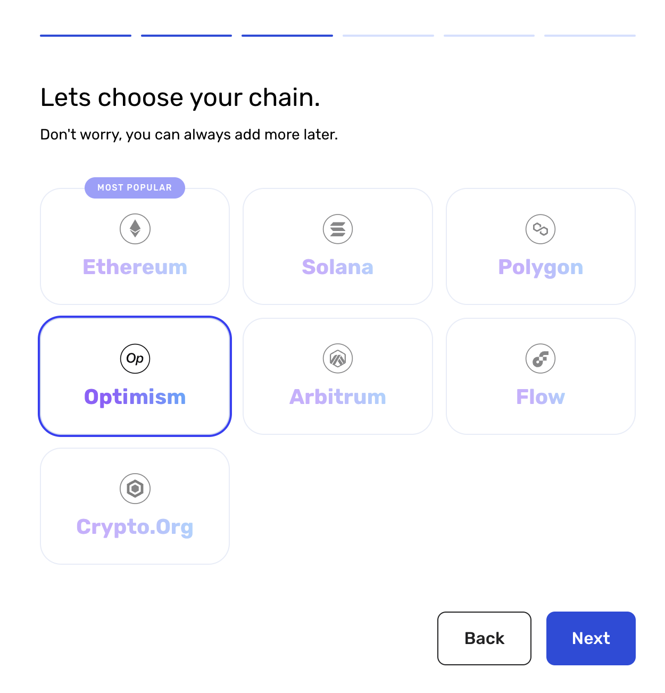
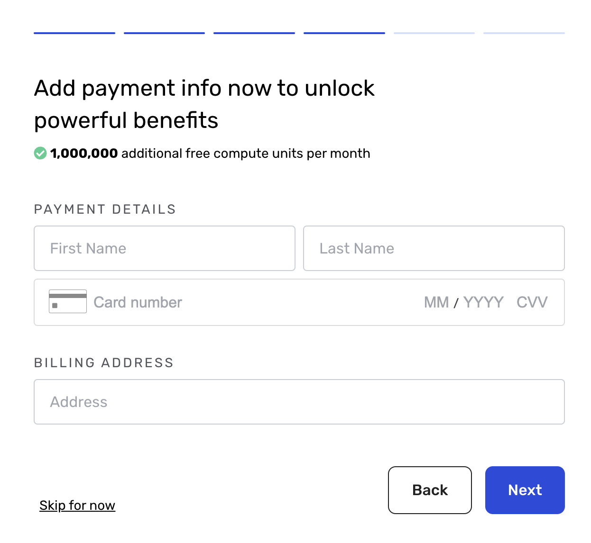
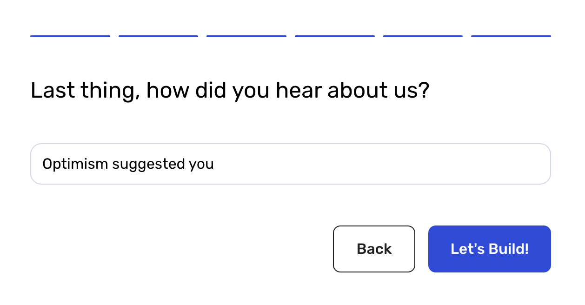
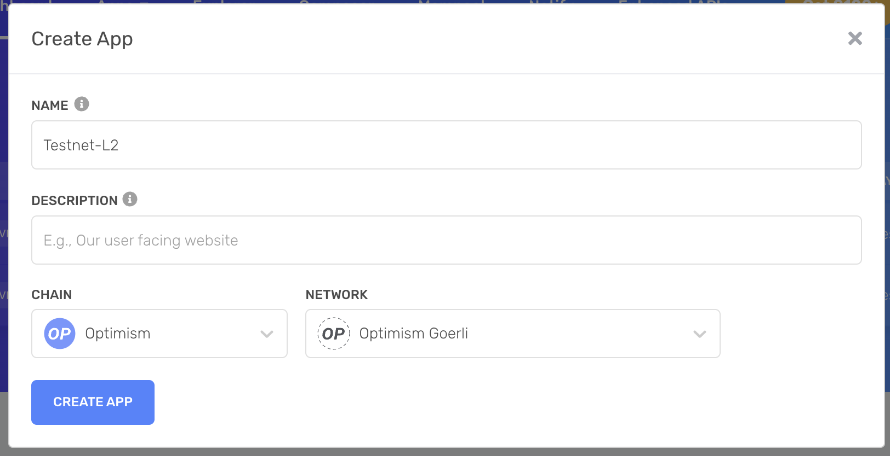
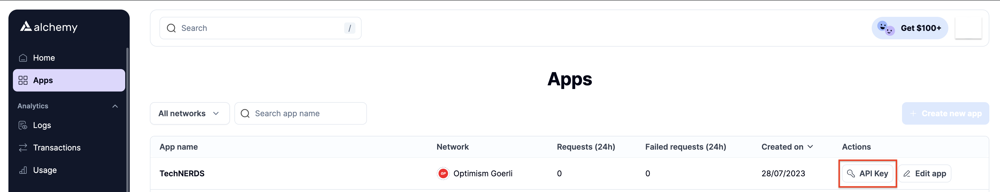
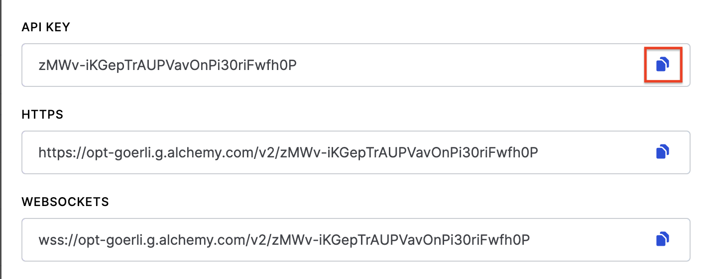

# Getting your API keys from Alchemy

This tutorial assumes you are completely new to Alchemy, but that you want to get applications and API keys to use with OP Mainnet or OP Goerli.

## Register

The first step is to register for a free Alchemy account.

1. Browse [to Alchemy](https://auth.alchemyapi.io/signup?redirectUrl=https%3A%2F%2Fdashboard.alchemyapi.io%2Fsignup%2F%3Freferrer_origin%3DDIRECT), enter user information, and click **Sign up**.

   

1. Go to your e-mail and click **VERIFY EMAIL**.

1. Fill up the requested information (team, type of project, etc.).

   

1. When asked for chain select **Optimism** and click **Next**.   

   

1. Select the free plan and click **Next**.   

1. Either enter payment details or click **Skip for now**.

   

1. Enter where you heard about Alchemy and click **Let's Build!**. 

   

## Create new applications

The next step is to create applications and get their API keys.

### Create a new OP Goerli application

1. Browse to the [Alchemy dashboard](https://dashboard.alchemyapi.io/).

1. Click **+CREATE APP**.

1. Specify a name, select the chain **Optimism** and the network **Optimism Goerli**.

   

1. Click **CREATE APP**.

1. Click **VIEW KEY** in the Testnet-L2 line

   

1. Copy the API Key.

   

   Alternatively, if you need a URL, copy the HTTPS definition.

### Create a new Goerli application

Follow the same instructions as for OP Goerli, but select the chain **Ethereum** and the network **Goerli**.