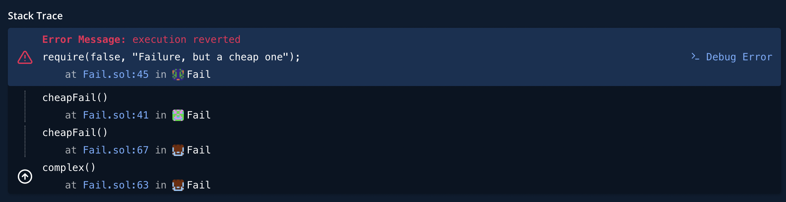
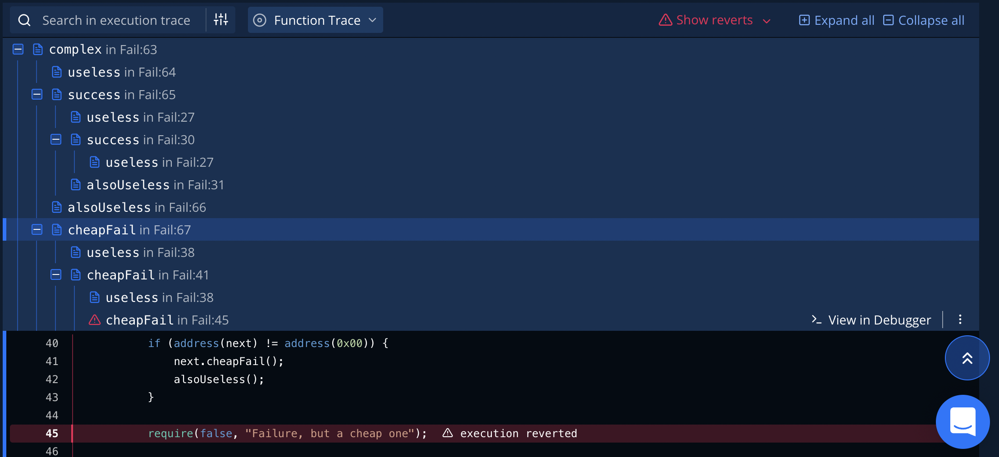
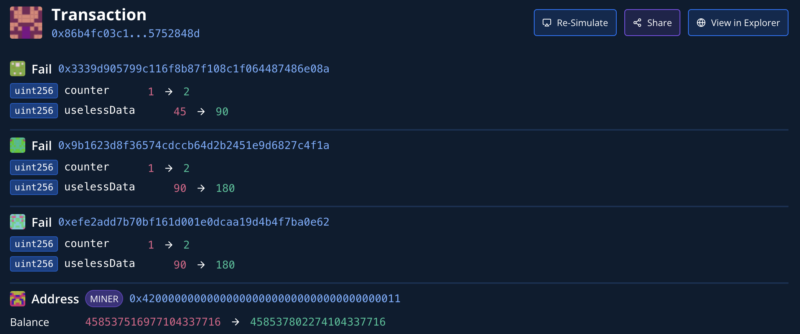
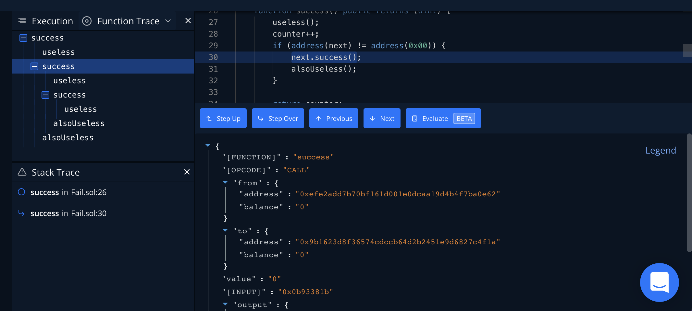

# Using Tenderly to Trace Transactions

OP Mainnet and OP Goerli transactions sometimes fail.
In this tutorial you learn how to use [Tenderly](https://tenderly.co/) to see what happened, what is the cause of the failure.

## Configuration

The contract we'll use as a sample for debugging is [Fail.sol](contracts/Fail.sol).

As samples, we have two transactions using this contract:

- [A successful transaction](https://goerli-optimism.etherscan.io/tx/0x86b4fc03c1656b64206cdedd1ef840563c1aa32a7ab7c2ca4c2dcb205752848d)
- [A failed transaction](https://goerli-optimism.etherscan.io/tx/0x9af716b7ef0ab4b4af9fbf95a7aa3f401140b07e055674c449299e18f918b938)

## Tenderly

Get a [Tenderly account](https://dashboard.tenderly.co/register?utm_source=homepage) if you don't have an account already.
The free tier is sufficient for what we do in this tutorial.

## Tracing a transaction

1. Search for the transaction hash.
   If Tenderly has that transaction, it will find it and tell you on what network it happened.
   For the purpose of this tutorial, search for the failed transaction (`0x9af716b7ef0ab4b4af9fbf95a7aa3f401140b07e055674c449299e18f918b938`).

   If the source code isn't in Tenderly, it can download it from Etherscan:

   1. Click the **Debugger** on the left sidebar.

   1. Click in the function trace on a contract where you don't have the source code yet.

   1. Click **Fetch the contract from public explorer**.
      Note that sometimes it takes a few minutes to fetch the source code.

1. In the overview you can see the stack trace.
   The different icons stand for different contract addresses (all implementing the same `Fail` contract in this case).

   

1. Below that you can see the function trace, including where exactly in the source the failure was and what happened before that.

   

   Because of the way we called `cheapFail` when it reverts it causes the entire transaction to revert.
   There is a way to call subcontracts without propagating revert, [see here for directions](https://stackoverflow.com/questions/72102722/can-transaction-fail-but-the-calling-contract-will-think-it-was-successful).

## Using the debugger

1. Trace the successful transaction (`0x86b4fc03c1656b64206cdedd1ef840563c1aa32a7ab7c2ca4c2dcb205752848d`).

1. Select **State Changes** on the left bar to see the state changes caused by the transaction.

   

1. Select **Debugger** on the left bar to see the function trace (which functions ran, which functions called which, etc.), the stack trace (the current funtion and who called it), the source code, and the 

   
   