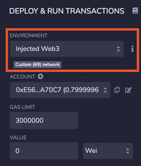

# Getting started developing for Optimism

[](https://discord.com/channels/667044843901681675)
[](https://twitter.com/optimismPBC)

This tutorial teaches you the basics of Optimism development. 
Because of [EVM equivalence](https://medium.com/ethereum-optimism/introducing-evm-equivalence-5c2021deb306) the differences are minor, but [they do exist](https://community.optimism.io/docs/developers/build/differences/#).

## Optimism endpoint URL

To access any Ethereum type network you need an endpoint. There are several ways to get one:

1. For the limited number of transactions required for development, rather than QA or production, you can use [Optimism-provided endpoints](https://community.optimism.io/docs/useful-tools/networks/). 

1. There is a number of service providers that provide Optimism endpoints, usually with a free tier for low usage.

   * [Alchemy](https://www.alchemy.com/layer2/optimism)
   * [Infura](https://infura.io/docs/ethereum#section/Choose-a-Network)
   * [QuickNode](https://www.quicknode.com/chains/optimism)

1. If you prefer to keep your code private, you can also [run a local development node](https://community.optimism.io/docs/developers/build/dev-node/).


### Network choice

For development purposes we recommend you use either a local development node or [Optimistic Kovan](https://kovan-optimistic.etherscan.io/).
That way you don't need to spend real money.
If you need Kovan ETH for testing purposes, [you can use this faucet](https://faucet.paradigm.xyz/).


### Connecting the development stack to Optimism

The exact steps to do this depends on the development stack you're using.

#### Dapp tools

In [dapp tools](https://github.com/dapphub/dapptools) use this command:

```sh
export ETH_RPC_URL=<Optimism URL>
```

#### Hardhat

In [Hardhat](https://hardhat.org/) you edit the `hardhat.config.js` file's `modules.export.networks` to add a definition similar to this one:

```js
    "optimistic-kovan": {
       url: '<Optimism URL>',
       accounts: { mnemonic: <your account mnemonic goes here> }

    }
```

#### Remix

In [Remix](https://remix.ethereum.org) you access Optimism through your own wallet.

1. Log on with your wallet to Optimistic Kovan (or, eventually, Optimistic Ethereum). 
   If you use the Optimism endpoints, you can do this using [chainid.link](https://chainid.link):
   - [Optimistic Kovan](https://chainid.link?network=optimism-kovan)
   - [Optimistic Ethereum](https://chainid.link?network=optimism)

1. Browse to [Remix](https://remix.ethereum.org/).
1. Click the run icon ().
1. Select the Environment **Injected Web3 Provider**.
1. Accept the connection in the wallet.

#### Truffle

In [Truffle](https://trufflesuite.com/):

1. Add the `@truffle/hdwallet-provider` package:

   ```sh
   yarn add @truffle/hdwallet-provider
   ```

1. Edit the `truffle-config.js` file

   1. Uncomment the this line:

      ```js
      const HDWalletProvider = require('@truffle/hdwallet-provider')
      ```

   1. Edit `modules.export.networks` to add a definition similar to this one:

      ```js 
      "optimistic-kovan": {
         provider: () => new HDWalletProvider(<your mnemonic>, <Optimism URL>)
      }
      ```

## Interacting with Optimism contracts

We have [Hardhat's Greeter contract](https://github.com/nomiclabs/hardhat/blob/master/packages/hardhat-core/sample-projects/basic/contracts/Greeter.sol) on Optimistic Kovan, at address [0xE0A5fe4Fd70B6ea4217122e85d213D70766d6c2c](https://kovan-optimistic.etherscan.io/address/0xe0a5fe4fd70b6ea4217122e85d213d70766d6c2c). 
You can verify your development stack configuration by interacting with it.
To see it, use the directories in this tutorial to run the console


### Run the console and attach to the contract

These steps vary between different development stacks:

#### Hardhat

1. Run the console:
   ```sh
   cd hardhat
   yarn
   yarn hardhat console --network optimistic-kovan
   ```

1. Connect to the Greeter contract:   

   ```js
   Greeter = await ethers.getContractFactory("Greeter")
   greeter = await Greeter.attach("0xE0A5fe4Fd70B6ea4217122e85d213D70766d6c2c")
   ```   

#### Truffle

1. Install the software, compile the contract, and run the console:

   ```sh
   cd truffle
   yarn
   yarn truffle compile
   yarn truffle console --network optimistic-kovan
   ```

1. Connect to the Greeter contact:

   ```js
   greeter = await Greeter.at("0xE0A5fe4Fd70B6ea4217122e85d213D70766d6c2c")
   ```

### Interact with the contract

1. Read information from the contact:

   ```js
   await greeter.greet()
   ```

1. Submit a transaction, wait for it to be processed, and see that it affected the state.
   Note that the account used by default, [0xf39Fd6e51aad88F6F4ce6aB8827279cffFb92266](https://kovan-optimistic.etherscan.io/address/0xf39Fd6e51aad88F6F4ce6aB8827279cffFb92266), may not have enough ETH. 
   In that case, edit the configuration file to use your own mnemonic.

   ```js
   tx = await greeter.setGreeting(`Hello ${new Date()}`)
   receipt = await tx.wait()   // Doesn't work in Truffle
   await greeter.greet()
   ```

### Remix

The way you interact with Kovan Optimism contracts using [Remix](https://remix.ethereum.org/), which is an [IDE](https://en.wikipedia.org/wiki/Integrated_development_environment), is a bit different.

1. Browse to [Remix](https://remix.ethereum.org/).

1. Click the run icon ().

1. Make sure your environment is **Injected Web3** and the network ID is **69**.

   

1. Click the files icon ().

1. Download [Greeter.sol](hardhat/contracts/Greeter.sol) and upload () it to Remix under **contracts**.